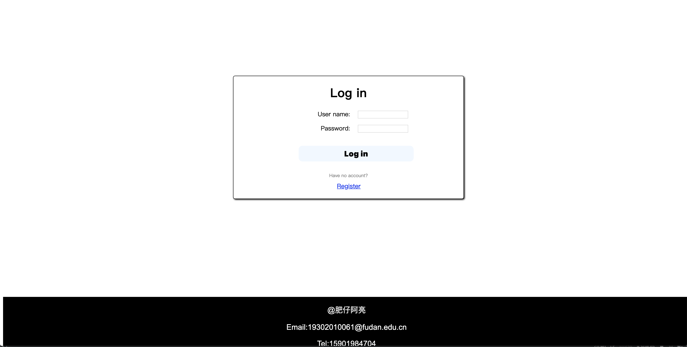
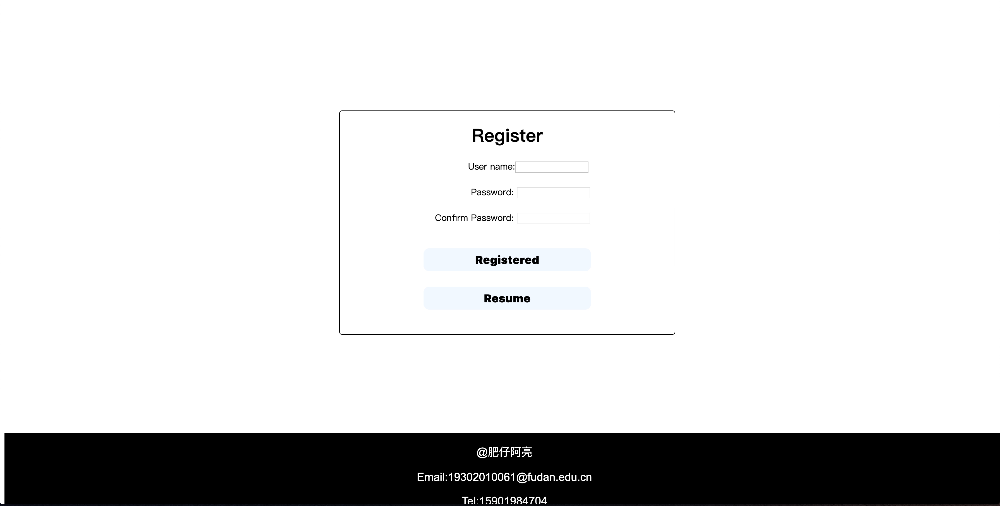
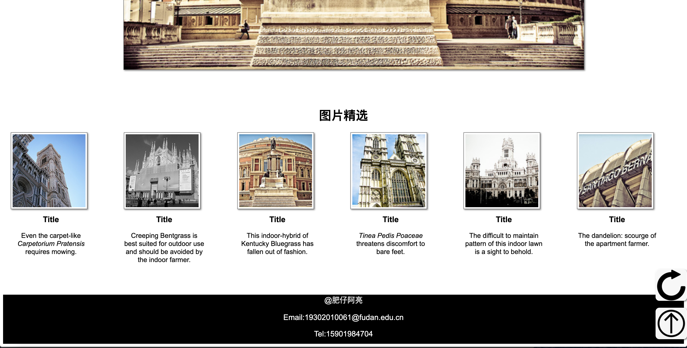
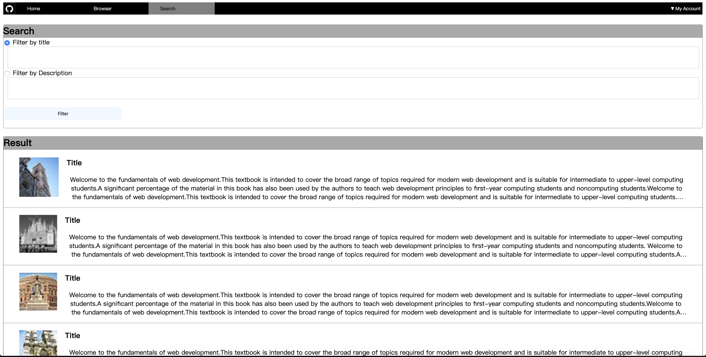
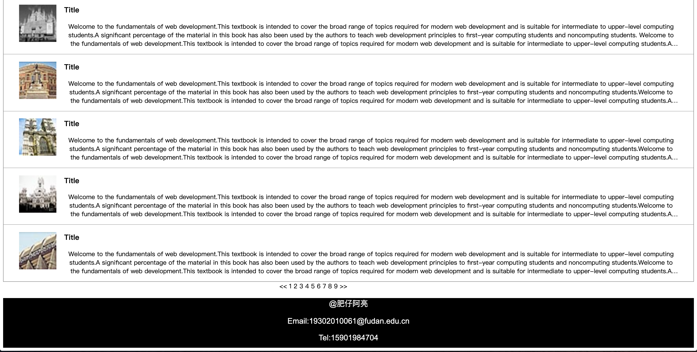
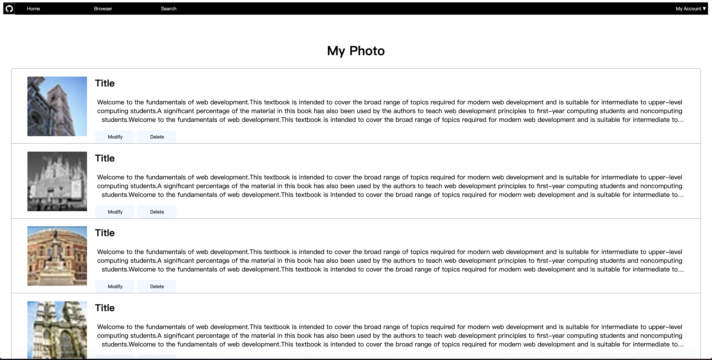
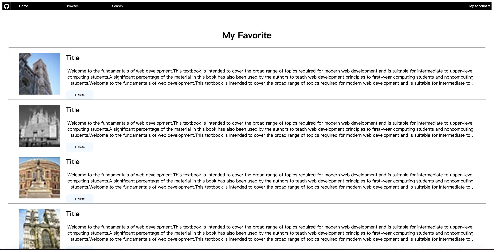
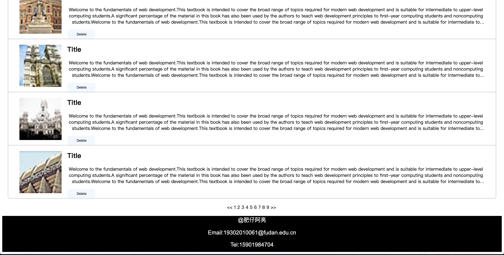
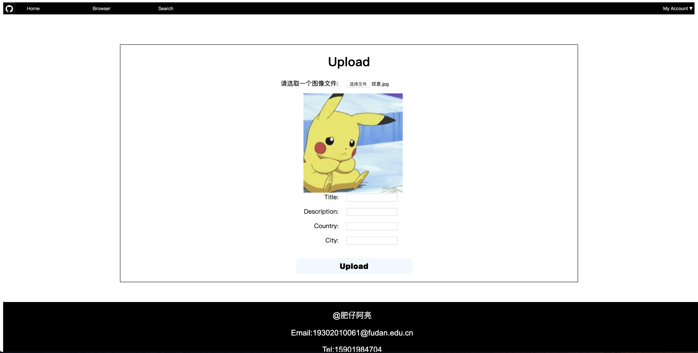
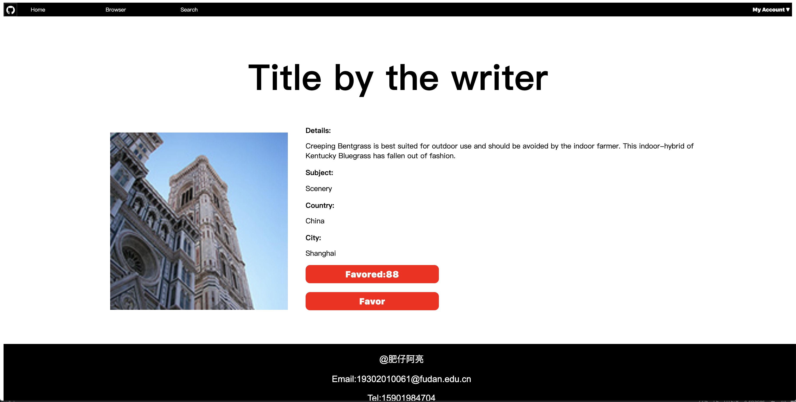

SOFT130002_Project1 梁菁菁 19302010061
==========
## GitHub 地址
### https://github.com/Liang-jing-jing/PJ1

## GitHub Pages地址
### https://liang-jing-jing.github.io/PJ1/

-------------------
## 项目完成情况

-------------------

### 登陆界面、注册界面
#### 登陆界面点击Upload按钮浏览器即会提示"Uploaded"并跳转到主页，点击register链接即会跳转到注册界面
#### 注册界面需要两次输入密码，如果两次输入不相同浏览器会给出提示

-------------------

### 主页
#### 导航栏上有GitHub图标、home、search、browser索引，还有My account，My account有下拉菜单
#### 鼠标在这些索引上时背景颜色会产生变化
#### 首页有头图和图片精选 图片精选放了六张图片，每一张图片都外加了边框和阴影，六张图片的摆放根据浏览器的大小而定，点击图片可跳转到详情页
#### 右下角有两个图标固定在t右下角，点击第一个会更新图片（仅仅是浏览器提示 alert），点击第二个会回到页面顶部

-------------------

### 浏览页
#### 导航栏同上，Browser处高亮
#### 左边有搜索栏，输入文字后点击搜索图标，浏览器即会提示"已搜索"
#### 下方有目录分别对应热门内容、热门国家和热门城市，点击后浏览器会有提示
#### 右边有筛选栏：国家和城市实现了二级联动，还可以筛选内容，点击Fileter按钮浏览器会给出提示
#### 摆放了12张图片，每张图片都有边框和阴影，点击图片可跳转到详情页
#### 右侧下方有目录，鼠标放在某一数字上其背景颜色会改变，点击后浏览器会提示当前为第几页

-------------------

### 搜索页
#### 导航栏同上，Search处高亮
#### 上方有选择框可以根据内容或者标题筛选（默认标题），点击Filter按钮浏览器会提示"已搜索"
#### 下方有图片和标题以及描述文字，描述文字溢出为... ，点击图片会跳转至详情页
#### 目录同上

-------------------

### 我的照片、我的收藏
#### 都展示了图片、标题、简介，简介溢出为... ,点击图片可跳转至详情页
#### 目录同上
#### My Photo页面每张图片旁边都有修改和删除按钮，修改按钮跳转至Upload界面，删除按钮点击后浏览器会提示"已删除"
#### My Favourite页面每张图片旁边都有删除按钮，删除按钮点击后浏览器会提示"已删除"

-------------------

### 上传界面
#### 可以上传图片、标题、描述、国家和城市
#### 点击Upload按钮后跳转到My Photo界面
#### 下图展示了如果上传了图片会显示在浏览器中，没图片时按钮上写着"选择文件"

-------------------

### 图片详情页
#### 显示标题、作者、详情、主题、国家、城市、被收藏数
#### 点击Favor按钮浏览器提示"已收藏"

-------------------
